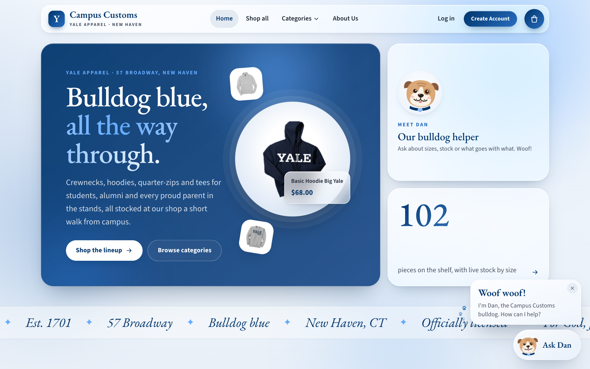

# DESIGN — Campus Customs storefront

**What this is.** The design document for the Campus Customs website: how it
looks, how it is laid out, how it moves, and why. `harness.md` covers the
system behind the page; this file covers what the shopper sees. Every value
comes from the front-end code: `frontend/src/styles.css` (tokens and layout),
`frontend/index.html` (fonts), `App.tsx`, `components/` and `pages/`.
Screenshot names (`home.png`, …) are files in `app_check_images/`, from the
Problem 11 app check.

## 1. The brief

The design was set in two steps (`AI_prompts.md`):

- **Problem 3.** Modern, clean, minimalist Bauhaus, but without the geometric
  shapes. Layout, fonts and colours follow Yale's web identity guidelines
  (https://yaleidentity.yale.edu/guidelines/websites). Home and About take the
  shop's style from yalebulldogblue.com, in our own words.
- **Problem 10.** Keep the palette; move to glassmorphism with a very modern
  layout. Add a cart, a Categories menu (with the residential colleges,
  varsity sports, graduate and professional schools, and the whole family), a
  bulldog helper called Dan who pops up with a "Woof woof", and more motion.
  Problem 9's front-end features (similar items, complete the look) sit on the
  product page.

The principles taken from it:

1. **Yale first.** Yale Blue and its tints, Yale's serif and sans (or free
   stand-ins), and nothing that competes with them.
2. **Function before ornament** (the Bauhaus part). A strict grid, a clear
   type hierarchy, one colour for action, and no decorative circles, triangles
   or squares. The only round forms are soft: blurred colour fields behind the
   glass, and the white disc that holds the featured product.
3. **Glass holds content; it isn't the content.** Frosted panels give depth;
   product photos stay on white, so the garment is what you look at.
4. **Honest signals.** Stock shows everywhere. Green and orange are kept for
   stock and status, so they always mean something.
5. **Motion that explains.** Things move to show where they went (into the
   cart, onto the page) or that work is happening (Dan's team).

## 2. Visual identity

### 2.1 Colour (`:root` in `styles.css`)

| Token | Value | Used for |
|---|---|---|
| `--yale-blue` | `#00356b` | Headings, prices, primary buttons, selected states, the shopper's chat bubbles |
| `--blue-1` | `#286dc0` | Links, eyebrow labels, the second stop of every button gradient |
| `--blue-2` | `#63aaff` | Focus rings, accents on dark panels, busy indicators |
| `--blue-3` | `#a9cdf5` | A backdrop colour field, the chat avatar disc |
| `--blue-wash` | `#e8f0fa` | The edge of every product photo well |
| `--ink` / `--ink-2` | `#1d2533` / `#4a5263` | Body text / secondary text, leads, counts |
| `--stone` | `#978d85` | Sold-out size letters, disabled controls, the "Chat ended" dot |
| `--rule` | `rgb(0 53 107 / 0.12)` | Hairlines between sections |
| `--accent-green` | `#5f712d` | "In stock", "Done", a teammate's report spark |
| `--accent-orange` | `#bd5319` | Low stock, "Not in your size", the cart count badge |

The page is two radial washes (blue-2 at 22%, blue-1 at 14%) over a gradient
from `#f3f7fc` to `#e9f0f8`, fixed while it scrolls. Buttons use a 135°
gradient from Yale Blue to blue-1. The colour filter's swatches show the
garment's own colour (`shop/filters.ts`): navy `#14284b`, gray `#b9bdc4`,
charcoal `#4a4e55`, cream `#f3ecdc`, coral `#ef8a76`.

### 2.2 Typography

`index.html` loads EB Garamond (400, 500, 600, italic 400) and Source Sans 3
(400, 600, 700) as free stand-ins for Yale's licensed typefaces. The CSS names
Yale's fonts first, so a machine that has them uses them: `--serif` is
`'YaleNew', 'Yale', 'EB Garamond', Georgia, …`; `--sans` is `'Mallory',
'Source Sans 3', 'Helvetica Neue', Arial, …`.

| Element | Font | Size | Notes |
|---|---|---|---|
| Body | sans | 17px, line height 1.6 | 16px on phones |
| `h1` / `h2` / `h3` | serif | `clamp(40px, 5.2vw, 68px)` / `clamp(30px, 3.4vw, 46px)` / 24px | Weight 500, line height 1.06 (h3 1.2), −0.015em, Yale Blue |
| `.display` (hero, About, account panels) | serif | `clamp(44px, 4.8vw, 78px)` | Line height 1, −0.02em |
| `.lead` | sans | `clamp(18px, 1.5vw, 21px)` | `--ink-2`, at most 40em wide |
| `.eyebrow` | sans | 13px, weight 700 | Uppercase, 0.16em tracking, blue-1 |
| Marquee | serif italic | `clamp(22px, 2.4vw, 32px)` | Yale Blue |

Every section uses the same three steps: an eyebrow says what this is
("Staff picks"), a serif heading gives the line ("Layer up like a local."),
and sans text gives the detail. The serif carries the Yale feel; the sans does
the work.

### 2.3 The glass treatment

Glass gives depth and a modern feel without adding shapes; the blurred fields
behind it have no edges.

- **`.glass`:** a white gradient (72% to 48% opacity), a 1px white border at
  78%, a 30px radius, `--shadow-md` with a thin inner highlight, and
  `backdrop-filter: blur(22px) saturate(170%)`.
- **`.glass--dark`:** Yale Blue at 94% to `rgb(14 62 128 / 0.86)` with white
  text, for the home hero, the Visit panels, the footer, the account side
  panels and the chat header. Blurred "orbs" drift inside.
- **The backdrop** (`Backdrop` in `App.tsx`): four colour fields blurred 70px
  (blue-2, blue-1, blue-3, and a faint orange at 16%) drifting over 28–40
  seconds, under a 28px dot grid that fades out down the page.
- **The header** turns more opaque after 8px of scroll. Its frosting sits on a
  `::before` layer, so the mega menu inside it can frost the page too.
- **Nearly solid where text must read:** the mobile menu (96%), the size
  helper (95%), the small-screen filter drawer and Dan's bubble.

### 2.4 Shape, spacing and depth

| Token | Value | Used for |
|---|---|---|
| `--r-xl` / `--r-lg` / `--r-md` / `--r-sm` | 30 / 22 / 16 / 12px | Panels and tiles / header bar and product cards / photo wells and notices / skeletons and team nodes |
| `--r-pill` | 999px | Buttons, filter pills, chips |
| `--max`, `--gutter` | 1320px, `clamp(16px, 3.6vw, 40px)` | Content width, side padding |
| `--header-h` | 92px (84px at ≤960px) | Sticky offsets and scroll padding |
| `.section` | `clamp(36px, 5vw, 72px)` top and bottom | Vertical rhythm |

Shadows come in three levels (`--shadow-sm`, `-md`, `-lg`), tinted navy
(`rgb(0 33 71)`) rather than grey; a hover lift moves a card from small to
large. `--ease-out` (`cubic-bezier(0.2, 0.8, 0.2, 1)`) drives most movement
and `--ease-spring` (`cubic-bezier(0.34, 1.56, 0.64, 1)`) the small pops.
Buttons are pills at least 48px tall (38px small). Icons are our own line
icons (`Icons.tsx`, 1.8 stroke), not a library. The wordmark is a serif "Y" on
a Yale Blue tile beside "Campus Customs" and "Yale apparel · New Haven".

### 2.5 Product photos

The photos come from the local data pack (`data/products/`). Many were
transparent PNGs flattened onto black, which looked like holes on a light
page. `main.py` (`web_ready_jpeg`) turns dark background touching the border
white (`BACKGROUND_THRESHOLD = 10`), fills enclosed gaps on light garments
only (on a dark one a gap may be the inside of a hood), trims a 2px halo
(`EDGE_TRIM_PX`) and feathers the edge. `tools.IMAGE_VERSION = 3` (`?v=3` on
every image URL) makes browsers fetch the cleaned version.

Each photo sits in a square well with a radial gradient from white to
`--blue-wash`, with `mix-blend-mode: multiply` so the photo's white background
melts into the well. That gives one look across 102 photos shot in different
ways. A sold-out product's photo drops to 55% opacity and 60% greyscale.

## 3. Layout and navigation

### 3.1 The frame on every page (`App.tsx`)

In order: a "Skip to content" link, the backdrop, the sticky header, the cart
toast, `<main>` (the chat's product shelf above the page), the footer, the
cart drawer and the chat. The chat sits outside the routes, so the
conversation survives page changes. Each page is keyed by its path, so it
plays its entrance. Tab titles read "{page} · Campus Customs".

- **Header:** the wordmark; Home, Shop all, Categories (a mega menu) and About
  Us; "Hi, {first name}" and Log out, or Log in and Create Account; and a round
  cart button with an orange count badge. A filtered shop (type, collection or
  colour in the URL) lights up Categories instead of Shop all.
- **Footer:** dark glass with the 57 Broadway address, shop and account links,
  and "Questions? Ask Dan." with a Chat with Dan button. Below it: "An
  officially licensed retailer, independent of Yale University."

### 3.2 The Categories mega menu (`NavBar.tsx`)

On a device with hover it opens 120 ms after the pointer arrives and closes
220 ms after it leaves, so passing through doesn't flicker. A click toggles
it; Escape, a click outside or any navigation closes it. Up to 980px wide, it
has three columns: Shop by type, Collections, and a "Not sure where to
start?" panel. Each row has a 44px cover photo and a count pill. The lists
come from `GET /api/categories` (`backend/tools.py`, Shop categories), with
counts worked out from the database on each request. Today's numbers:

| Shop by type | Pieces | Collections | Pieces |
|---|---|---|---|
| Hoodies | 25 | Residential colleges | 19 |
| Crewnecks | 29 | Varsity sports | 34 |
| Quarter-zips | 11 | Graduate & professional schools | 13 |
| Tees & long sleeves | 27 | The whole family | 12 |
| Jackets & zip-ups | 10 | Yale classics | 24 |

Why not Tops / Bottoms / Men / Women: every product is a unisex top, so those
splits would put everything in one bucket (harness §8.1). The four
collections from the brief are there, with "Yale classics" for the rest
(`categories_menu.png`).

### 3.3 The pages

| Route | What's on it | Screenshot |
|---|---|---|
| `/` Home | A bento grid: the dark hero ("Bulldog blue, all the way through.") with the Basic Hoodie Big Yale floating on a white disc beside two smaller pieces; a "Meet Dan" tile that opens the chat; a live count tile ("102 pieces on the shelf, with live stock by size"). Then a scrolling marquee, the five types, four staff picks, numbered collection tiles 01–04, and a Visit panel. | `home.png`, `home_sections.png` |
| `/products` Shop | A header whose title and blurb follow the filters, a search box, a sticky 290px filter panel, a toolbar (count and sort), removable chips, and the grid. | `products.png`, `filters.png` |
| `/products/:id` | Breadcrumb, a sticky photo beside details and buying, recommendations below. | `product_detail.png` |
| `/categories` | Type tiles, collections with their colleges, teams, schools and family roles as pills with counts, and colour chips. | `categories_page.png` |
| `/cart` | Cart lines beside a sticky 360px summary. | `cart_page.png` |
| `/about` | A display heading, "What we carry", three numbered values, a Visit panel. | `about.png` |
| `/login`, `/create-account` | A dark glass panel with a display heading beside a glass form. | `login.png`, `create_account.png` |
| any other | 404: "We couldn't find that page." | |

## 4. The shopping flow

### 4.1 Browse, filter and sort (`ProductsPage.tsx`, `shop/filters.ts`)

- **Filters:** type; collection, which opens its colleges, teams, schools or
  family roles as smaller pills; colour; "In stock in size"; a price slider
  whose ends come from the catalogue ($32 to $98 today); "Hide sold-out
  pieces". Sorts: Featured (in stock first), price, name, best stocked. Search
  filters as you type.
- **No dead ends:** each option's count reflects the other filters, and
  options that would give nothing are disabled. If the list is still empty,
  Dan says "Nothing matches all of that." with Clear filters and Ask Dan.
- **In the URL** (`?type=hoodies&color=navy&size=M&sort=price-asc`), so menu
  links, chips, Back and shared links all work.
- **Feedback:** "14 of 102 pieces", announced to screen readers; active
  filters as Yale Blue chips that turn orange on hover, since a click removes
  them; an 8-card skeleton while loading.

### 4.2 The product card (`ProductCard.tsx`, `AddToCart.tsx`)

One card is used everywhere: shop, home, recommendations and the chat's shelf.
It holds the photo well; a badge ("Sold out", or "Almost gone" in orange at 8
units or fewer); the garment type with its college or team as a pill; the
serif name; and the price. Recommendation cards add a role ("Wear under") and
a reason; chat-shelf cards add three lines of description and a stock line
("In stock: S, M, L, XXL"). The name's link is stretched over the whole card,
so the whole card opens the product, and the cart button sits above it rather
than inside a link.

Add to cart shows on hover or focus (always on touch screens) and opens "Pick
a size", with sold-out sizes crossed out and disabled. Picking one sends the
photo flying to the cart, and the button reads "Added M" for 1.8 seconds.

### 4.3 The product page (`ProductDetailPage.tsx`)

- **Layout:** the large photo on the left, sticky under the header; on the
  right, type and collection pills (links to a filtered shop), the serif name,
  the price and the full description.
- **Sizes:** a grid of three (two on phones). Each cell shows its stock: "25
  in stock" in green, "Only 3 left" in orange at 5 or fewer (`LOW_STOCK`), or
  "Sold out" with the letter struck through.
- **Buying:** a quantity stepper and one button that says what will happen:
  "Choose a size", "Add 2 × M to cart · $136.00", "Sold out in XS", "All 4 in
  M are in your cart". A line never passes the stock in that size, or 10.
  "Find my size" and "Ask Dan" links sit underneath.
- **Below** (`Recommendations.tsx`): if the picked size is sold out, an orange
  "Not in your size" callout with similar styles in stock in that size comes
  first; then "Complete the look · Wear it with" and "Similar styles"
  (`sold_out_alternatives.png`, `complete_the_look.png`).

### 4.4 The size & fit helper (`SizeHelper.tsx`)

A modal up to 560px wide, opened from the product page or the filters. It
asks for units (ft · lb or cm · kg), height, weight, an optional chest
("optional, most accurate") and Snug / Regular / Relaxed. The answer is a
large size badge with "We'd go with M" (or "M, or L for a different fit"
between sizes), the reasoning, the fit note and live stock for a product, then
"Choose M" or "Show what's in stock in M", "Add M to cart" when in stock, and
a fold-out size chart. Measurements stay in the tab and aren't saved; the form
says so (`size_helper.png`).

### 4.5 The cart (`cart/`, `CartDrawer.tsx`, `CartToast.tsx`, `CartPage.tsx`)

- **Storage:** this browser's `localStorage` (`cc-cart-v1`); no account needed.
- **Every add gives feedback:** a copy of the photo arcs into the cart button
  (720 ms), the button bounces, the badge pops, and a toast drops under the
  header for 3.6 seconds with a draining timer bar. If the size is sold out or
  the line is full, the toast says so instead.
- **The drawer** slides in from the right (up to 440px). Empty, Dan says
  "Your cart's empty. Let's fetch something blue!"
- **The cart page** re-checks every price and stock count against the live
  catalogue ("Sold out in M now"). Checkout is a disabled "Checkout coming
  soon" button with a note to bring the list to 57 Broadway. The shop doesn't
  take online orders, and a fake checkout would break the About page's promise
  of straight answers.

Screenshots: `fly_to_cart.webp`, `cart_toast.png`, `cart_drawer.png`.

## 5. The chat and Dan

### 5.1 Dan

Dan is an SVG English bulldog (`DanAvatar.tsx`): fawn (`#dba878`) and white,
an underbite with two lower teeth, and a Yale Blue collar with a "Y" tag. The
chat sets his mood:

| Mood | When | What moves |
|---|---|---|
| Idle | Most of the time | Blinks every 4.6 s, ears twitch every 5.5 s, tag swings |
| Thinking | While a reply is being built | Head tilts, eyes look around |
| Happy | 2.6 s after a reply, and while his bubble is up | Tongue out and panting, head wiggles |

He appears on the launcher, in the chat, on the home page, in the footer and
in empty states. A mascot suits a shop for the Bulldogs, and a face makes help
easier to find than a chat icon. His voice rules (§9) keep the dog light.

### 5.2 The launcher and pop-up (`DanLauncher.tsx`)

The closed chat is a pill 22px from the bottom right: Dan at 60px, bobbing,
and "Ask Dan" in the serif. Once per visit (`sessionStorage`,
`cc-dan-greeted`), 1.4 s after load, a bubble pops up with "Woof woof!" and a
line for the page: "Want help picking your size? Just ask!" on a product
page, "Need something to go with that? I can help!" on the cart, and "I'm Dan,
the Campus Customs bulldog. How can I help?" elsewhere. Three paw prints trot
up beside it. It stays 12 seconds; hovering Dan brings it back. Opening the
chat plays a short woof made with Web Audio (`dan_popup.png`).

### 5.3 The panel (`ChatWidget.tsx`)

- **Frame:** up to 420 × 660px at the bottom right, radius 28px, light glass.
  The dark header shows Dan and a status dot: green "Your Campus Customs
  bulldog", pulsing blue "Sniffing around the shelves…", or grey "Chat
  ended". Buttons: Sound on / off (remembered), Clear (logged-in shoppers),
  close.
- **Greeting:** "Woof woof!" (with the first name when logged in), one paw
  emoji, and "How can I help?". Starter questions follow the page: "What goes
  with this?" and "What size should I get?" on a product page; "What hoodies
  do you have?" and "Gift ideas for my dad" elsewhere.
- **Notes:** "Log in to save this chat for next time." for guests; for a
  logged-in shopper an "I remember: Size XS · Likes navy" line with Forget.
- **Bubbles:** the shopper's on the right in the Yale Blue gradient; Dan's
  white on the left beside his avatar. Enter sends; Shift+Enter adds a line.

### 5.4 The live team view (`TeamActivity.tsx`)

While a reply is being built, a card shows Dan on top and the Scout and
Stylist on "wires" below, each with its model tier (Terra or Luna) and state
(Standing by, Thinking, On it, Done). Busy members pulse pale blue; Done turns
green. A blue spark runs down a wire when Dan hands off a task, and a green
one runs back with the report. A log shows the last four steps in plain
English. With sound on: pew on a hand-off, thunk when a report lands, tick per
database lookup, chime when the answer is ready. After the reply, "Behind the
scenes · Dan + Scout · 2.3 s" folds out the steps and the tokens per tier. It
shows the work instead of a spinner (`agent_team_live_stylist.png`,
`agent_team.webp`).

### 5.5 Cards in the chat and on the page

- **Chat cards:** compact rows with a 52px photo, the name (opens the
  product), price and stock, and a "+ Add" button with the same size picker.
- **Suggestion groups:** cards with a role and a reason. Alternatives ("In
  stock in XS instead") are titled in orange; "Complete the look" in Yale Blue.
- **The shelf on the page** (`ChatShowcase.tsx`): browse results go onto the
  page, not into the chat. A glass shelf ("Dan fetched these", the title, a
  count pill) sits at the top of `<main>` with one snapping row of the
  standard card: four across on desktop, 70% wide on a phone, with ← / →,
  Hide / Show and Clear. On a product page it folds to one line so the item
  comes first; at 1100px and wider it stops short of the open chat. The chat
  keeps a "See all 27 hoodies on the page ↑" button.

The page is the bigger canvas, and the shopper gets the same card and product
page they already know (`search_cards.png`, `showcase_to_detail.png`).

### 5.6 The ended-chat notice

The server ends a chat at once for rudeness, or after three off-topic or
manipulation messages in a row (`MAX_STRIKES = 3`), for 15 minutes
(`LOCK_MINUTES`). The input is replaced by a peach notice, the tint of the
error notices: "Dan ended this chat.", then "Let's keep things friendly." or
"He can only help with Campus Customs shopping.", then "You can start a new
chat at 4:15 PM." in the shopper's own time zone. The dot turns grey, focus
moves to the notice, and the chat reopens by itself when the time is up. The
tone is calm: what happened and when they can come back, no scolding.

## 6. Motion

| What | How | Timing |
|---|---|---|
| Page change | Fades in, rises 14px | 0.55 s |
| Scroll reveal | Sections fade in and rise 26px when first seen (`useReveal.ts`) | 0.7 s, 70 ms apart |
| Product cards | Rise in one after another; lift 6px and zoom the photo on hover | 0.6 s, 45 ms apart |
| Home hero | Copy rises in; the featured piece floats; small pieces float and tilt | 6–8 s loops |
| Marquee, backdrop, orbs | Scroll and drift | 38 s; 28–40 s; 14–18 s |
| Add to cart | Sizes pop in; photo flies to the cart; cart bounces; badge pops | 720 ms flight, 0.6 s bounce |
| Toast, drawer, modal | Drop in with a timer bar; slide in; spring up | 0.45 s + 3.6 s; 0.42 s; 0.4 s |
| Dan | Blink, ears, tag, bob; tilt when thinking; pant when happy | 3–5.5 s loops; 1.8 s; 0.32 s |
| Chat | Panel springs open; messages rise; team members pulse; sparks travel | 0.45 s; 0.35 s; 1.1 s; 0.7 s |

Motion shows where something went or that work is happening. It never blocks
input, and the long loops are slow and soft so they stay in the background.

**Reduced motion.** Under `prefers-reduced-motion: reduce`, `styles.css`
turns off every animation, transition and smooth scroll; `useReveal` hides
nothing; and `flyToCart` skips the flight. Dan still changes mood (the tongue
shows when he's happy), but nothing moves. Sound has its own Sound off switch.

## 7. Responsive behaviour

| Width | What changes |
|---|---|
| ≤1180px | The header greeting hides. Type rail 3 columns; collection tiles, four-card grids and value pillars 2. The bento goes to 2 columns with the hero full width. |
| ≤960px | Header 84px. Nav and account links move behind a menu button; the menu drops over the page with the links, "Cart (n)", the category lists and account buttons. Hero, section heads, About, Visit, product page, account pages, cart and shop header go to one column. The product photo stops being sticky. Filters become a 360px drawer from the left with a "Show 14 pieces" button. |
| ≤600px | Body 16px. The wordmark tagline and the hero's floating pieces hide. Product grids 2 columns; Add to cart becomes a 40px icon. Size grid 2 columns; quantity and Add to cart stack. The launcher drops its label. The chat fills the screen (8px margins, 22px radius). |

On touch screens (`hover: none`) Add to cart is always shown and the mega menu
opens on tap only. Screenshots: `mobile_home.png`, `mobile_menu.png`,
`mobile_filters.png`, `mobile_chat.png`.

## 8. Accessibility

- **Skip link and focus:** "Skip to content" jumps to `#main`. Every focusable
  element gets a 3px blue-2 outline, 3px out; on a product card it goes round
  the whole card.
- **Dialogs:** the cart drawer and size helper are modal dialogs. Focus moves
  in and returns on close, Escape closes them, and the page behind doesn't
  scroll. The chat is a labelled dialog: opening focuses the input, Escape
  closes it, focus returns to the launcher.
- **State is announced:** `aria-pressed` on pills, swatches, size cells and
  the sound button; `aria-expanded` on Categories, the menu button, Add to cart
  and the shelf; live regions on the shop count, chat messages and quantities;
  status roles on the toast, Dan's bubble, the team view and the ended-chat
  notice; alert roles on form errors.
- **Labels:** icon buttons say what they do ("Cart, 2 items", "Remove Morse
  1/4 Zip, size M"); decorative photos have empty alt text; each password
  field has a labelled Show / Hide button.
- **Not colour alone:** stock is written out ("Only 3 left", "Sold out");
  sold-out sizes are also struck through, and screen readers hear "(sold
  out)".
- **Keyboard and touch:** everything is a real button or link. Buttons are at
  least 48px tall (38px small) and icon buttons 42px.

Contrast against solid white (the glass sits on near-white): Yale Blue 12.2:1
(white on Yale Blue the same), ink 15.4:1, ink-2 7.8:1, blue-1 5.2:1, green
5.4:1, orange 4.8:1. Stone is 3.3:1, so it is used only for struck-out
sold-out letters and disabled controls, never as the only label.

## 9. The voice of the copy

- **Our own words.** Home and About are written fresh in the spirit of
  yalebulldogblue.com, not copied. The facts kept are the shop's own: 57
  Broadway, New Haven, CT 06511; officially licensed; Campus Customs runs Yale
  Bulldog Blue.
- **A neighbourhood shop.** Short, warm lines with light school spirit: "Pick
  your layer.", "Something for every Bulldog.", "Find your corner of Yale.",
  "Blue, of course. And friends."
- **Straight answers.** About promises to say plainly when a size is sold out
  or a colour isn't offered, and the interface keeps it: exact stock, no fake
  checkout, plain errors ("We couldn't load the lineup right now. Please
  refresh to try again."). Buttons say what happens: "Add 2 × M to cart ·
  $136.00", "Show 14 pieces".
- **Dan sounds like a dog, lightly.** "Sniffing around the shelves…", "Let's
  fetch something blue!". In replies, `prompts/prompt.md` (Voice) allows at
  most one "Woof!" per conversation and one dog touch per message, one paw
  emoji only when greeting, and one to three sentences for a simple question.
  If asked, he says he's an AI helper.

## 10. How the design serves the shopper

| Shopper's goal | What the design does |
|---|---|
| "Is it in my size?" | Stock by size on the product page and chat-shelf cards, an "In stock in size" filter, the size helper, in-stock alternatives for a sold-out size |
| "Find something fast" | The Categories menu with counts, filters that never lead to an empty list, search, and Dan, whose results land on the page |
| "Can I trust the price?" | Prices and stock come from the live database, the cart re-checks them, no fake checkout, and "Behind the scenes" shows how each answer was made |
| "What goes with it?" | "Complete the look" on every product page, and the Stylist in the chat |
| "Does it feel like Yale?" | Yale Blue, the Yale serif or its stand-in, the bulldog, the marquee of campus words |
| "Shop on my phone" | Two-column grids, a filter drawer, a full-screen chat, large tap targets |
| "Don't pester me" | Dan pops up once per visit for 12 seconds, sound can be turned off, motion stops under reduced motion |

For the business: sold-out sizes become alternatives instead of exits, outfit
pairings grow the basket, and every card is one click from the cart.

## 11. Known gaps

- **404 button.** "Back home" uses a `button--outline` class that
  `styles.css` doesn't define, so it shows as a second solid button.
- **Smooth scrolling under reduced motion.** The CSS rule stops smooth
  scrolling, but the shelf's own scrolls (`behavior: 'smooth'` in
  `ChatShowcase.tsx`) still glide.
- **Two phone widths.** The chat fills the screen at ≤600px, but opening a
  card closes it only at ≤560px (`ChatWidget.tsx`).
- **Colour or color.** Filters and Categories say "Colour"; the product page
  says "Colors" and the chat placeholder "color".
- **Fonts load from Google Fonts.** Offline, the type falls back to Georgia
  and Helvetica Neue / Arial.
